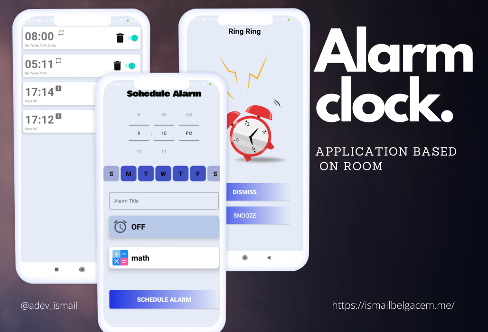

# Alarm clock

in this project will be Application based on Room .


## Installation

```bash
 def room_version = "2.3.0"

    implementation "androidx.room:room-runtime:$room_version"
    annotationProcessor "androidx.room:room-compiler:$room_version"

    // optional - RxJava2 support for Room
    implementation "androidx.room:room-rxjava2:$room_version"

    // optional - RxJava3 support for Room
    implementation "androidx.room:room-rxjava3:$room_version"

    // optional - Guava support for Room, including Optional and ListenableFuture
    implementation "androidx.room:room-guava:$room_version"

    // optional - Test helpers
    testImplementation "androidx.room:room-testing:$room_version"

    // optional - Paging 3 Integration
    implementation "androidx.room:room-paging:2.4.0-alpha04
````
## Screenshots

## Author

**Ismail BLegacm**

- [Profile](https://github.com/ismail998 "ismail belgacem")
- [Email](mailto:blegasemismail@gmail.com?subject=Hi "Hi!")
- [Website](https://ismailbelgacem.me/ "Welcome")

## 🤝 Support

Contributions, issues, and feature requests are welcome!

Give a ⭐️ if you like this project!
## Contributing
Pull requests are welcome. For major changes, please open an issue first to discuss what you would like to change.

Please make sure to update tests as appropriate.

## License
[MIT](https://choosealicense.com/licenses/mit/)
